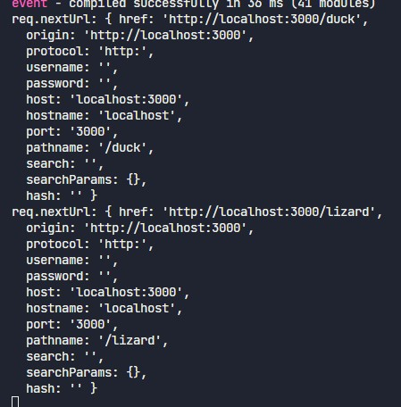

# Middleware POC
This repository highlights some of the issues I came across doing simple apps.

Given a `middleware.ts` file with this content:

```ts
import { type NextRequest, NextResponse } from "next/server"

const PAGES = ['/duck', '/lizard']

export const config = {
  matcher: '/'
}

export default function handler(req: NextRequest) {
  req.nextUrl.pathname = PAGES[Math.floor(Math.random() * PAGES.length)]

  console.log('req.nextUrl:', req.nextUrl);

  return NextResponse.rewrite(req.nextUrl)
}
```

Everytime I visit `/` I get two logs, one requesting the `/` page, and another one that looks identical but that its indeed asking for `http://localhost:3000/_next/data/development/index.json`



We can see several issues with this example:
* nextUrl.href is not showing the actual resource href but a sanitized one.
* In cases where we randomize things without storing values, or in cases where the service returns different data for the page request and the json request, we get a "layout shift". With a page showing for the prerender and a totally different page is shown after hydration.
* A workaround for this would be to omit running middleware for the json file but we can't do it in the matcher.

[DEMO](https://middleware-issues-poc.vercel.app)